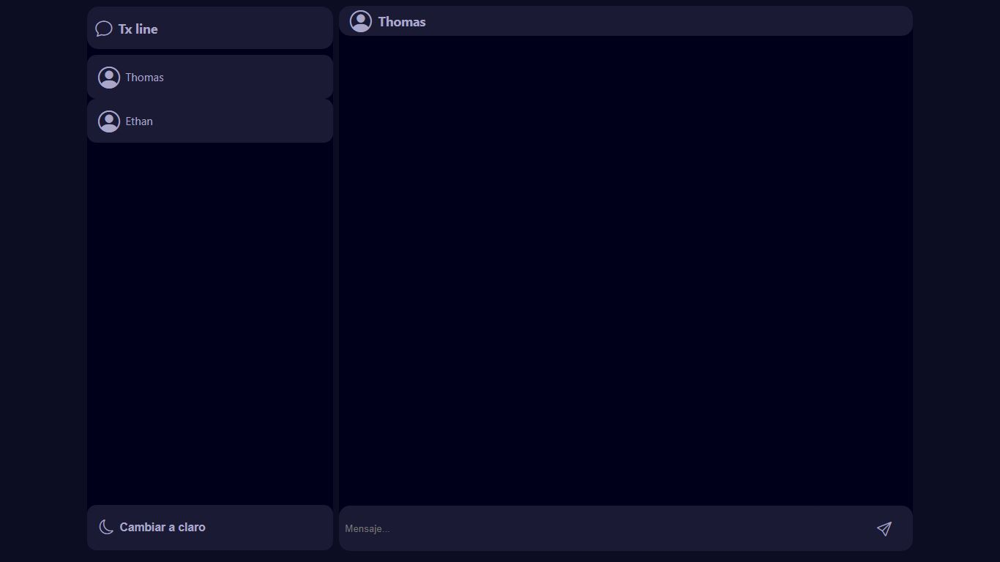

# Chat

<br><br><br>

## Descripción

Este proyecto consiste en un chat en tiempo real desarrollado con Node.js y WebSockets. Cuenta con una interfaz intuitiva y moderna. Permite la comunicación entre usuarios con mensajes instantáneos y ofrece un diseño agradable.



## Características

- Modo claro y oscuro
- Mensajeria en tiempo real con WebSockets
- Diseño responsivo con HTML, CSS y JavaScript
- Backend con Node.js y Express.js
- Manejo eficiente de eventos y conexiones

## Tecnologías

- **Frontend:** HTML, CSS, JavaScript
- **Backend:** Node.js, Express.js
- **Comunicacion:** Websockets (Socket.io)

## Instalación y ejecución

1. Clona este repositorio:
    ```bash
    https://github.com/samoel-andres/chat.git
    ```
    
2. Navega a la carpeta del proyecto:
    ```bash
    cd chat
    ```
    
4. Instala las dependencias:
    ```bash
    npm install
    ```
    
5. Configura las variables de entorno:<br>
   Crea un archivo `.env` en la raiz del proyecto con la siguiente configuración:
    ```bash
    PORT=3000
    ```
    
6. Ejecuta la aplicación:
   ```bash
   npm start
   ```
   
